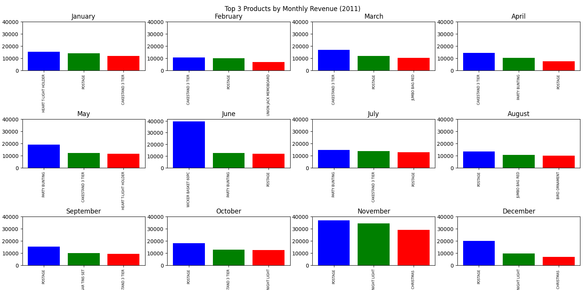
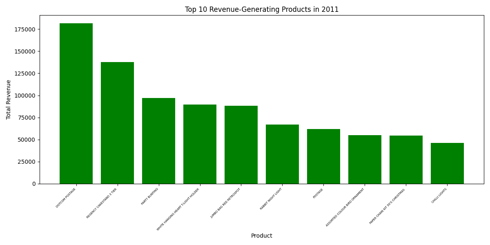

# 2011 YILI E-TİCARET SATIŞ ANALİZİ

Bu proje, **Online Retail** veri seti kullanılarak 2011 yılına ait satışların analiz edilmesi amacıyla geliştirilmiştir. Temel amaç; veri işleme, gruplama ve görselleştirme teknikleri kullanarak **her ayın en çok gelir elde eden 3 ürününü** ve **tüm yılın en çok gelir getiren 10 stratejik ürününü** belirleyip sunmaktır.

Bu analiz ile şunlar hedeflenmiştir:
* Yıl boyunca satış gelirleri açısından öne çıkan ürünleri tespit etmek.
* Aylık satış trendlerini (mevsimsellik dahil) analiz etmek.
* En çok gelir getiren ürünlerin yıl boyunca gösterdiği performansı incelemek.

---

## Veri Seti

-   **Dosya:** `Online_Retail.csv`
-   **Kaynak (Kaggle):** [Online Retail Dataset by Bojan Tunguz](https://www.kaggle.com/datasets/tunguz/online-retail)
-   **Veri Seti Konumu:** Dosya büyüklüğü nedeniyle, veri seti ZIP formatında (`Online_Retail_VeriSeti.zip` adıyla) bu depoya yüklenmiştir.
-   **Kapsam:** 01/12/2010 - 09/12/2011 tarihleri arasında İngiltere merkezli çevrim içi perakende satış kayıtları
-   **Kullanılan Sütunlar:**
    -   `InvoiceDate` → Satış tarihi
    -   `Description` → Ürün açıklaması
    -   `Quantity` → Satılan miktar
    -   `UnitPrice` → Ürün birim fiyatı

---

##  Kullanılan Teknolojiler

-   **Python**
-   **Pandas** → Veri temizleme, dönüştürme ve işleme
-   **Matplotlib** → Sonuçların görselleştirilmesi
-   **NumPy** → Sayısal hesaplamalar

---

##  Analiz Süreci

Bu analiz, ham veriden nihai görsellere ulaşana kadar aşağıdaki aşamaları takip etmiştir:

### 1. Veri Hazırlığı ve Temizleme
1.  **Gereksiz Sütun Kaldırma:** Analizde kullanılmayacak olan `InvoiceNo`, `StockCode`, `CustomerID` ve `Country` sütunları veri setinden kalıcı olarak kaldırıldı.
2.  **Tarih Dönüşümü:** `InvoiceDate` sütunu, zaman serisi filtrelemeleri için gerekli olan `datetime` formatına dönüştürüldü.

### 2. Aylık Veri İşleme ve Ciro Hesaplama
1.  **Aylara Ayırma:** Veri seti, 2011 yılına ait 12 ayın her biri için ayrı DataFrame'lere (sözlük içinde) filtrelenerek ayrıldı.
2.  **Ciro (Revenue) Hesaplama:** Her bir aylık DataFrame için, satılan miktar (`Quantity`) ile birim fiyat (`UnitPrice`) çarpılarak ürün bazında gelir (`Revenue`) sütunu oluşturuldu.

### 3. Aylık Top Ürün Tespiti
1.  **Ürün Bazında Toplama:** Her ayın verisi, `Description` (Ürün Açıklaması) bazında gruplandırılarak toplam `Revenue` (gelir) hesaplandı.
2.  **Sıralama ve Seçim:** Elde edilen aylık gelirler büyükten küçüğe sıralanarak, her ay için en çok gelir getiren **ilk 3 ürün** tespit edildi.
3.  **İsim Kısaltma:** Grafik okunabilirliğini artırmak amacıyla, Top 3 ürün isimleri kısaltma sözlüğü kullanılarak güncellendi.

### 4. Yıllık Veri Birleştirme ve Nihai Görselleştirme
1.  **Yıllık Birleştirme:** Tüm aylık veriler, `pd.concat` metodu ile tek bir yıllık DataFrame'de birleştirildi.
2.  **Yıllık Toplam Ciro:** Birleştirilmiş yıllık veri, `Description` bazında gruplandırılarak yıl genelindeki toplam `Revenue` hesaplandı.
3.  **Yıllık Top 10 Seçimi:** Toplam gelire göre sıralama yapılarak, 2011 yılının en çok gelir getiren **ilk 10 ürünü** seçildi.
4.  **Görselleştirme:** Sonuçlar iki ana grafik setinde (Aylık Top 3 ürünler için 3x4 subplot ve Yıllık Top 10 ürünler için tek çubuk grafik) sunuldu.

---

## Görseller ve Çıktılar

###  Aylık En Çok Gelir Getiren 3 Ürün (2011)

###  2011 Yılında En Çok Gelir Getiren 10 Ürün

---

##  Projeyi Çalıştırma

1.  **Dosya Yapısı:** `Online_Retail.csv` ve Python kodunuz (`E_Ticaret_Analiz_2011.py`) **aynı klasörde** olmalıdır.
2.  **Kütüphane Kurulumu:** Projenin bağımlılıklarını kurun: `pip install pandas matplotlib numpy`
3.  **Çalıştırma:** Terminalde veya PyCharm'da kodu çalıştırın: `python E_Ticaret_Analiz_2011.py`

---

##  Geliştirici ve İletişim

Bu proje, **Tuğba Demir** tarafından geliştirilmiştir.

* **E-posta:** **demitugba490@gmail.com**

---
